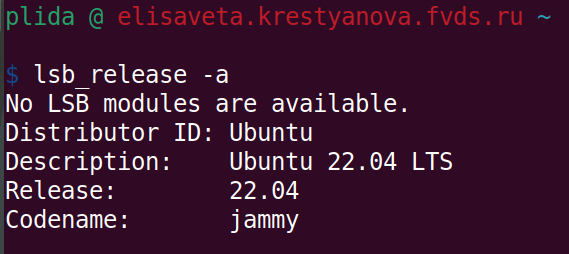
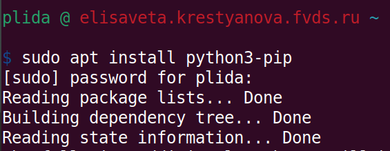
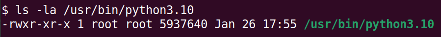
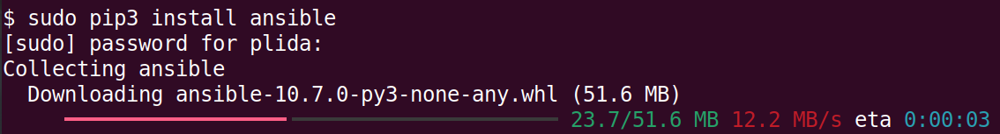
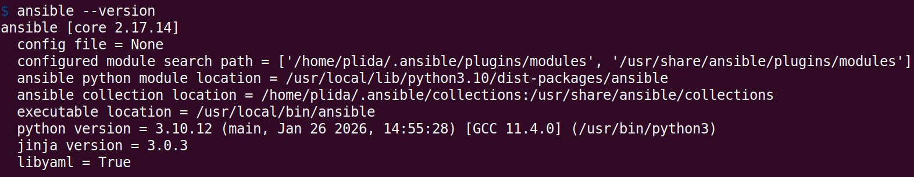
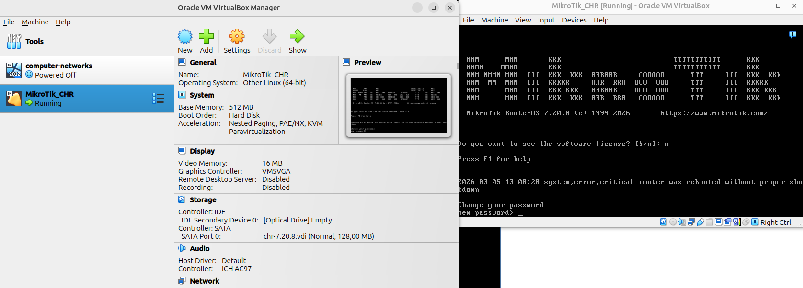

University: [ITMO University](https://itmo.ru/ru/)<br />
Faculty: [FICT](https://fict.itmo.ru)<br />
Course: [Network programming](https://github.com/itmo-ict-faculty/network-programming)<br /> 
Year: 2025/2026<br />
Group: K3323<br />
Author: Krestyanova Elisaveta Fedorovna<br />
Lab: Lab1<br />
Date of create: 05.03.2025<br />
Date of finished: ---<br />

# Задание

Данная работа предусматривает обучение развертыванию виртуальных машин (VM) и системы контроля конфигураций Ansible а также организации собственных VPN серверов.

Цель работы: развертывание виртуальной машины на базе платформы Microsoft Azure с установленной системой контроля конфигураций Ansible и установка CHR в VirtualBox

Ход работы:

Вам необходимо развернуть виртуальную машину с помощью Microsoft Azure в режиме студенческой подписки.

Если не получается в Microsoft Azure, можете выбрать любого бесплатного облачного провайдера

В бесплатном режиме Microsoft Azure предлагает для виртуальных машин только Ubuntu 16.4, нам нужна Ubuntu 18.+ поэтому необходимо обновить операционную систему. Сделать это можно с помощью данных команд:

```
sudo apt update & sudo apt upgrade
sudo do-release-upgrade
```

Теперь необходимо установить python3 и Ansible:

```
sudo apt install python3-pip
ls -la /usr/bin/python3.6
sudo pip3 install ansible
ansible --version
```

Далее вам необходимо на вашем компьютере установить VirtualBox а на него CHR (RouterOS).


После этого вам необходимо создать свой Wireguard/OpenVPN/L2TP сервер для организации VPN туннеля между вашим сервером автоматизации где был установлена система контроля конфигураций Ansible и вашим локальным CHR.


После всех манипуляций вам необходимо будет поднять VPN туннель между вашим VPN сервером на Ubuntu 18 и VPN клиентом на RouterOS (CHR)

# Схема

# Ход работы 

## Выбор хостинга

Где хостить этот сервер?

Microsoft Azure? Там необходимо ввести зарубежную банковскую карту.

Yandex Cloud? Даётся стартовый грант но всего на 2 месяца. Вдруг что случится, и грант закончится до завершения лабораторных работ дисциплины?

Но что есть у студента, пишущего это? VPS, за который он платит денежку уже 3-й год. 

И на этом сервере стоит Ubuntu 22-й версии:



Зачем думать, когда можно не думать? 

Главное в процессе выполнения работ не грохнуть случайно сервер, а то от него зависят вообще-то все остальные работы других дисциплин :)

## Конфигурация сервера

Устанавливаем Python:





И Ansible:





## Установка CHR

На ноутбуке с Ubuntu (архитектура x86_64) был когда-то установлен VirtualBox для дисциплины "Компьютерные сети". Тогда VirtualBox отказывался работать по нерешимой причине, и поэтому работа продолжилась на другом устройстве.

Год спустя VirtualBox внезапно заработал.

Окей.

Скачивается vdi образ CHR с сайта [Mikrotik-а](https://mikrotik.com/download?architecture=x86) и используется в качестве диска в VirtualBox, виртуальная машина запускается и логинимся:



## Wireguard

На VPS изначально был установлен Wireguard. Он используется для других лабораторных работ, где VPS выступает также в качестве сервера. Поэтому можем спасти себе часы работы и скопировать существующий конфиг


# Результаты

# Заключение

# Дополнительные источники

1. Установка CHR на VirtualBox: https://help.mikrotik.com/docs/spaces/ROS/pages/262864931/CHR+installing+on+VirtualBox

2. Доступ к CHR  https://forum.mikrotik.com/t/network-setting-in-virtual-box-to-connect-them-together/47714/3 