University: [ITMO University](https://itmo.ru/ru/)<br />
Faculty: [FICT](https://fict.itmo.ru)<br />
Course: [Network programming](https://github.com/itmo-ict-faculty/network-programming)<br /> 
Year: 2025/2026<br />
Group: K3323<br />
Author: Krestyanova Elisaveta Fedorovna<br />
Lab: Lab1<br />
Date of create: 05.03.2026<br />
Date of finished: 13.03.2026<br />

# Задание

Данная работа предусматривает обучение развертыванию виртуальных машин (VM) и системы контроля конфигураций Ansible а также организации собственных VPN серверов.

Цель работы: развертывание виртуальной машины на базе платформы Microsoft Azure с установленной системой контроля конфигураций Ansible и установка CHR в VirtualBox

Ход работы:

Вам необходимо развернуть виртуальную машину с помощью Microsoft Azure в режиме студенческой подписки.

Если не получается в Microsoft Azure, можете выбрать любого бесплатного облачного провайдера

В бесплатном режиме Microsoft Azure предлагает для виртуальных машин только Ubuntu 16.4, нам нужна Ubuntu 18.+ поэтому необходимо обновить операционную систему. Сделать это можно с помощью данных команд:

```
sudo apt update & sudo apt upgrade
sudo do-release-upgrade
```

Теперь необходимо установить python3 и Ansible:

```
sudo apt install python3-pip
ls -la /usr/bin/python3.6
sudo pip3 install ansible
ansible --version
```

Далее вам необходимо на вашем компьютере установить VirtualBox а на него CHR (RouterOS).


После этого вам необходимо создать свой Wireguard/OpenVPN/L2TP сервер для организации VPN туннеля между вашим сервером автоматизации где был установлена система контроля конфигураций Ansible и вашим локальным CHR.


После всех манипуляций вам необходимо будет поднять VPN туннель между вашим VPN сервером на Ubuntu 18 и VPN клиентом на RouterOS (CHR)

# Схема

# Ход работы 

## Выбор хостинга

Где хостить этот сервер?

Microsoft Azure? Там необходимо ввести зарубежную банковскую карту.

Yandex Cloud? Даётся стартовый грант но всего на 2 месяца. Вдруг что случится, и грант закончится до завершения лабораторных работ дисциплины?

Но что есть у студента, пишущего это? VPS, за который он платит денежку уже 3-й год. 

И на этом сервере стоит Ubuntu 22-й версии:

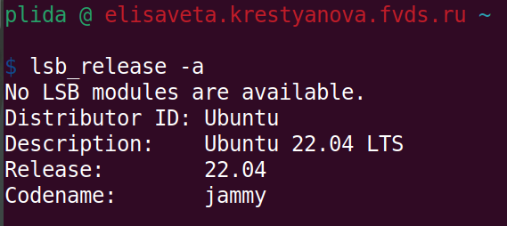

Зачем думать, когда можно не думать? 

Главное в процессе выполнения работ не грохнуть случайно сервер, а то от него зависят вообще-то все остальные работы других дисциплин :)

## Конфигурация сервера

Устанавливаем Python:

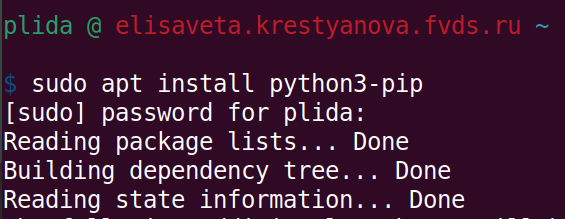

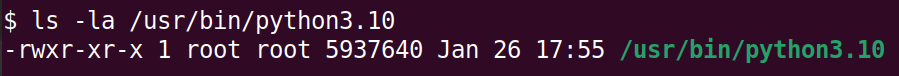

И Ansible:

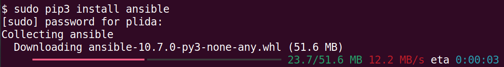

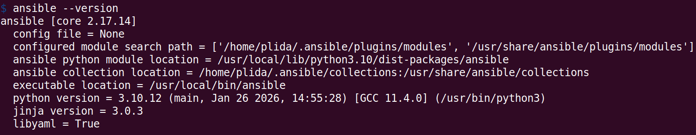

## Установка CHR

На ноутбуке с Ubuntu (архитектура x86_64) был когда-то установлен VirtualBox для дисциплины "Компьютерные сети". Тогда VirtualBox отказывался работать по нерешимой причине, и поэтому работа продолжилась на другом устройстве.

Год спустя VirtualBox внезапно заработал.

Окей.

Скачивается vdi образ CHR с сайта [Mikrotik-а](https://mikrotik.com/download?architecture=x86) и используется в качестве диска в VirtualBox. 

Почему именно CHR? Потому что это Cloud Hosted Router, он предназначен для работы в виртуальной среде.

В настройках сети виртуалки выставляем Bridged Adapter на нужный интерфейс ноутбука. Это позволит подключить роутер к сети.

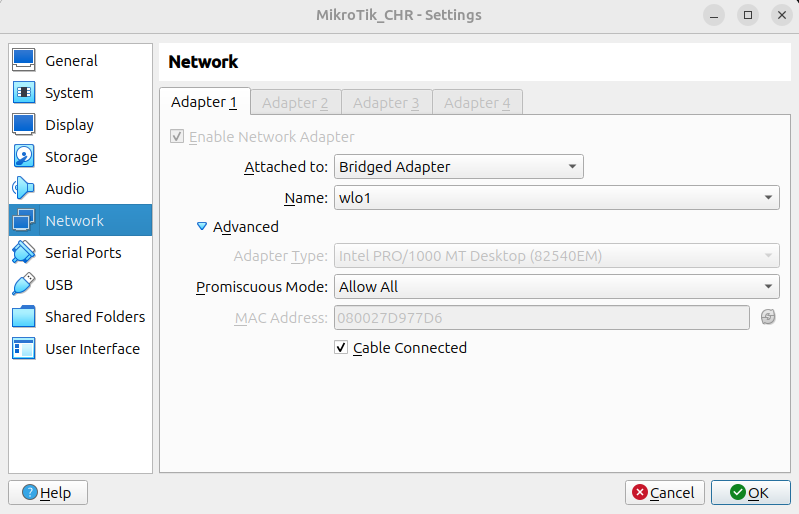

Виртуальная машина запускается и мы логинимся:

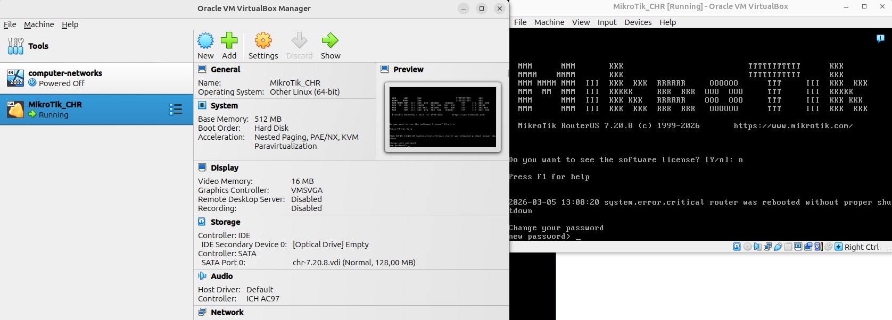

Проверяем: роутер к сети подключён.

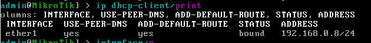

Где-то вдалеке вы слышите ругань студента, который отчаянно не мог пройти этот шаг... (см. [встреченные проблемы](#сеть-вуза))

## Wireguard

### Генерация ключей

На VPS генерируем ключи командой:

```
wg genkey | tee privatekey | wg pubkey > publickey
```

На CHR ключи генерируются при создании интерфейса:

```
/interface/wireguard
add listen-port=41168 name=portal
```

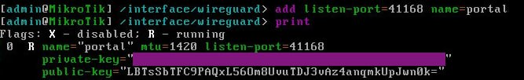

Публичный ключ CHR: 
LBTsSbTFC9PAQxL56Om8UvuTDJ3vAz4anqmkUpJwn0k=

Публичный ключ VPS:
QYsHcd/jPoRUWV2qb7A2Bb/JxeXLFUx39Qx+gr3VI2E=


### CHR

Назначаем пира - наш VPS. 37.230.113.18 это его публичный айпи адрес.

```
/interface/wireguard/peers
add allowed-address=10.220.220.1/24 endpoint-address=37.230.113.18 endpoint-port=41168 interface=portal public-key="QYsHcd/jPoRUWV2qb7A2Bb/JxeXLFUx39Qx+gr3VI2E="
```

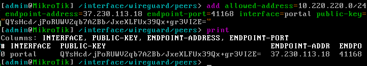

Указываем, какой айпи-адрес у CHR в этом туннеле:

```
/ip/address
add address=10.220.220.2/32 interface=portal
/ip/route
add dst-address=10.220.220.0/24 gateway=portal
```

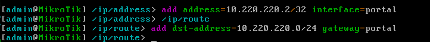

Брандмауэр CHR блочит по дефолту создание туннеля, так что надо это разрешить:

```
/ip/firewall/filter
add action=accept chain=input dst-port=41168 protocol=udp src-address=37.230.113.18
```

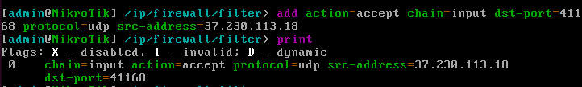

### VPS

На VPS изначально был установлен Wireguard. Он используется для других лабораторных работ, где VPS выступает также в качестве сервера. Поэтому можем спасти себе часы работы и скопировать существующий конфиг :)

```
[Interface]
Address = 10.220.220.1/24
ListenPort = 41168
PrivateKey = ###

[Peer]
# CHR
PublicKey = LBTsSbTFC9PAQxL56Om8UvuTDJ3vAz4anqmkUpJwn0k=
AllowedIPs = 10.220.220.2/32
PersistentKeepalive = 25
```

Затем туннель поднимается через ```sudo wg-quick up <имя конфига>```. 


# Результаты

Вывод WG и результаты пинг-тестов:

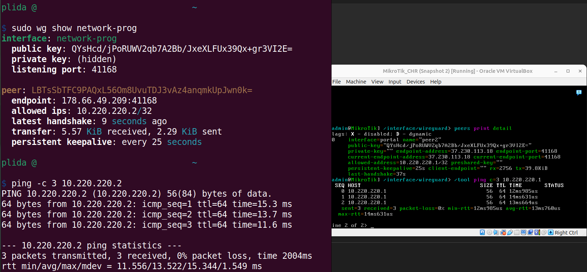

# Встреченные проблемы

## Сеть вуза

По пока не ясной мне причине, в вузе роутер не получал никоим образом айпи-адрес, даже при правильных настройках виртуалки. Вероятно, в вузе стоят ограничения, что странным неизвестным роутерам айпи-адреса не выдавать. Как только я принесла свой ноутбук домой, всё заработало.

## Неверно скопированные ключи

С CHR пингуется публичный айпи адрес сервера? Пингуется!

А туннелевский адрес пингуется? Не пингуется...

Что tcpdump говорит на VPS-е? Что запрос до VPS доходит... VPS отвечает? Нет...

И что в итоге? Оказалось, на стороне VPS в публичном ключе CHR я перепутала 0 и O. А-а-а-а-а-а-а-а!!!

Почему? Потому что я ручками вводила все ключи :) Мне было очень лень разбираться как буфер обмена в VirtualBox настроить.

Я решила это через установку Winbox, чтобы можно было удобно ctrl c + ctrl v все ключи.

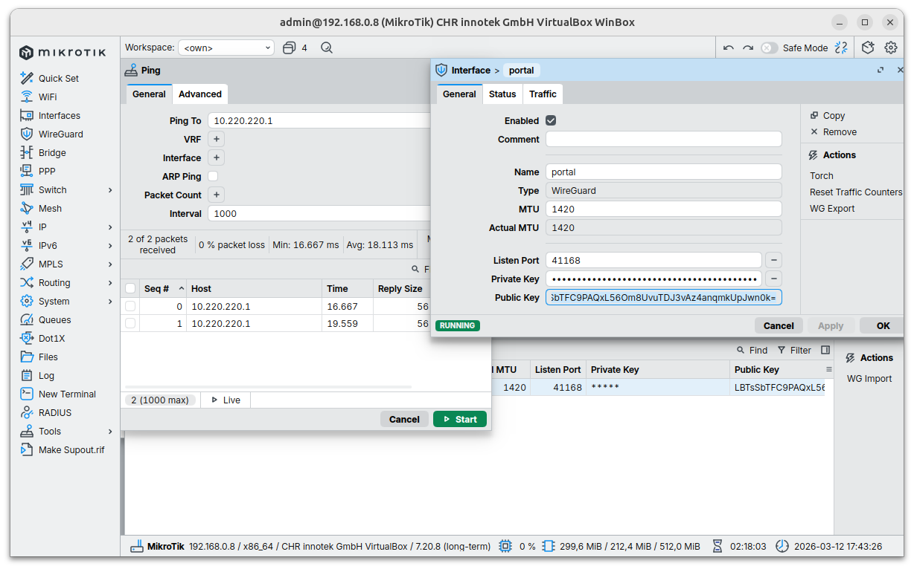

Верный публичный ключ вставила и всё заработало сразу же. О чудо.

# Заключение

В ходе работы был установлен Ansible и Python3 на VPS. В VirtualBox был импортирован CHR. CHR и VPS были связаны между собой wireguard туннелем.

Цель работы была выполнена.

# Дополнительные источники

1. Установка CHR на VirtualBox: https://help.mikrotik.com/docs/spaces/ROS/pages/262864931/CHR+installing+on+VirtualBox

2. Доступ к CHR  https://forum.mikrotik.com/t/network-setting-in-virtual-box-to-connect-them-together/47714/3 

3. Wireguard на Mikrotik: https://help.mikrotik.com/docs/spaces/ROS/pages/69664792/WireGuard