University: [ITMO University](https://itmo.ru/ru/)<br />
Faculty: [FICT](https://fict.itmo.ru)<br />
Course: [Network programming](https://github.com/itmo-ict-faculty/network-programming)<br /> 
Year: 2025/2026<br />
Group: K3323<br />
Author: Krestyanova Elisaveta Fedorovna<br />
Lab: Lab2<br />
Date of create: 13.03.2026<br />
Date of finished: 20.03.2026<br />

# Задание

В данной лабораторной работе вы на практике ознакомитесь с системой управления конфигурацией Ansible, использующаяся для автоматизации настройки и развертывания программного обеспечения.

Цель работы: С помощью Ansible настроить несколько сетевых устройств и собрать информацию о них. Правильно собрать файл Inventory.

Ход работы:

1. Установить второй CHR на своем ПК.
2. Организовать второй OVPN Client на втором CHR.
3. Используя Ansible, настроить сразу на 2-х CHR:
  - логин/пароль;
  - NTP Client;
  - OSPF с указанием Router ID;
4. Собрать данные по OSPF топологии и полный конфиг устройства.


# Схема

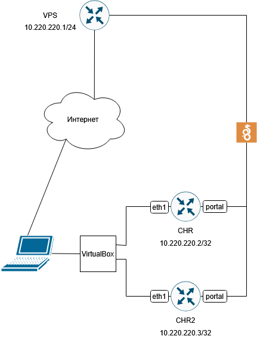

# Ход работы 

## Конфигурация 2-й роутера

При клонировании контейнера на нём dhcp-клиент перестал видеть нужный интерфейс валидным. В winbox я заново в настройках dhcp-клиента выбрала интерфейс ether2, и он очнулся, получив новый айпи-адрес.

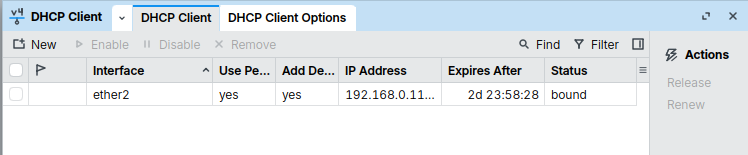

Меняем адрес на новый 10.220.220.3:

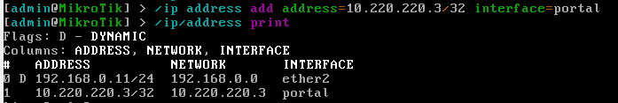

Создаём снова интерфейс, чтобы пересоздать ключи:

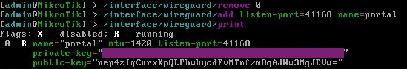

Привязываем снова айпи адрес к интерфейсу туннеля:

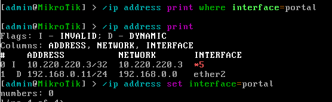

И шлюз:

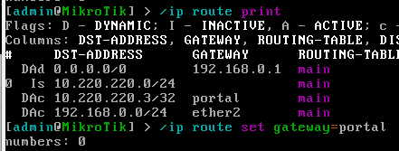

А в конфиг VPS добавляем соотвествующий пир:

```
[Peer]
# CHR 2
PublicKey = nep4zIqCurxKpQLPhwhycdFvMTnf/mOqAJWw3MgJEVw=
AllowedIPs = 10.220.220.3/32
PersistentKeepalive = 25
```

Проверяем:

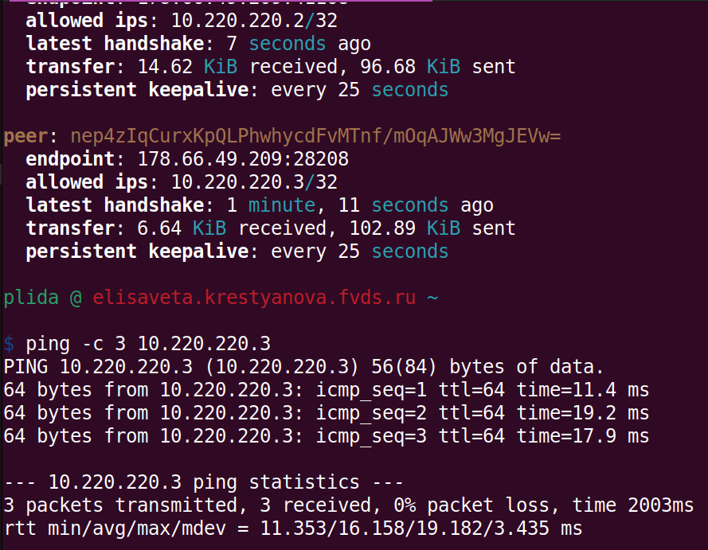

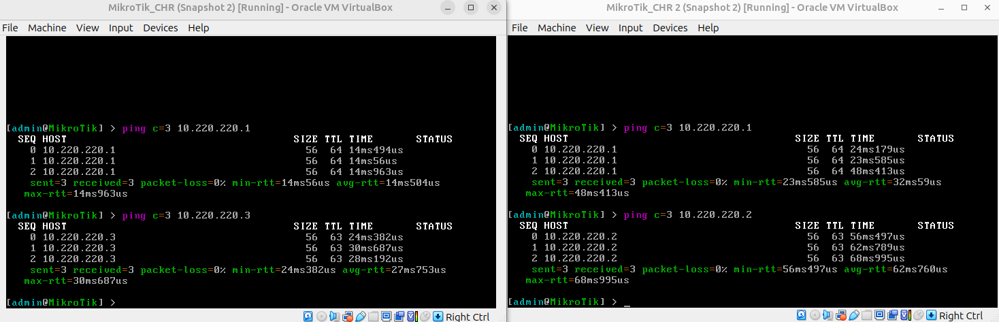

## Ansible

### Хосты Ansible

На VPS создаём hosts с айпи роутеров:

```
[routers]
CHR1 ansible_host=10.220.220.2
CHR2 ansible_host=10.220.220.3

[routers:vars]
ansible_user=admin
ansible_connection=ansible.netcommon.network_cli
ansible_network_os=community.routeros.routeros
```

Проверяем инвентарь:

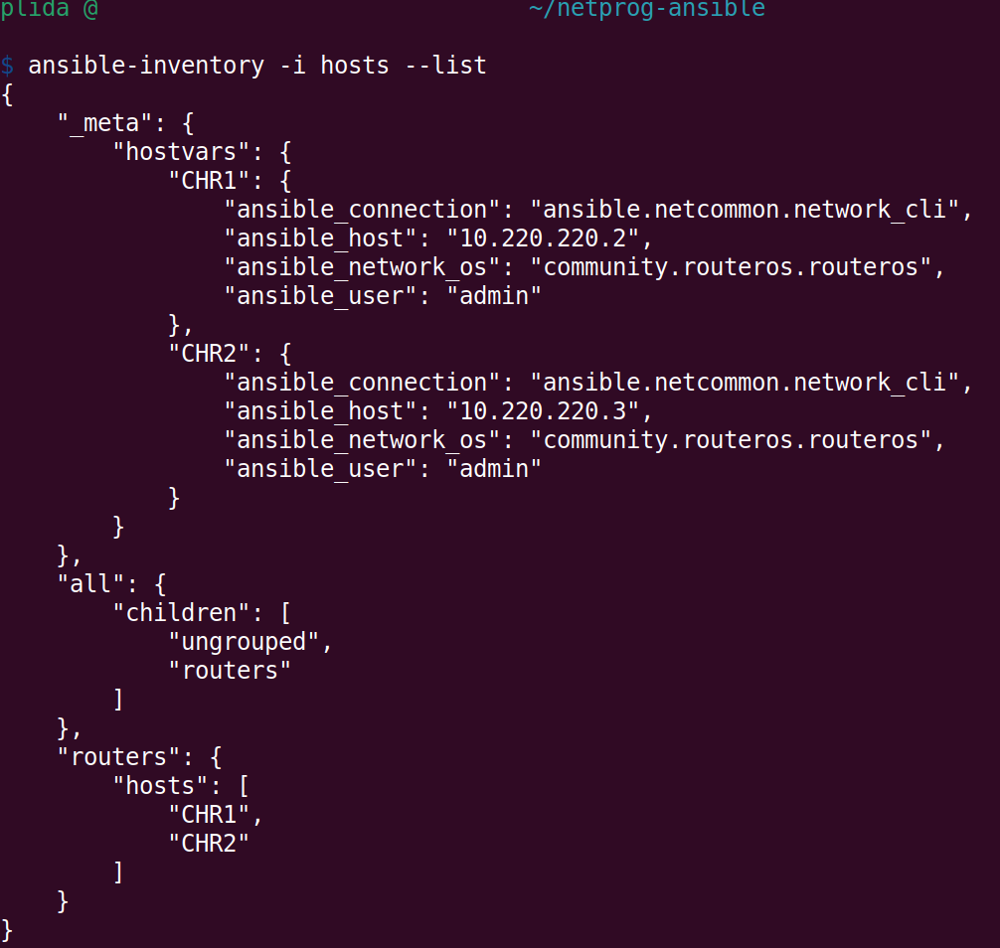

И проверяем, корректно ли подключается Ansible к роутерам: 

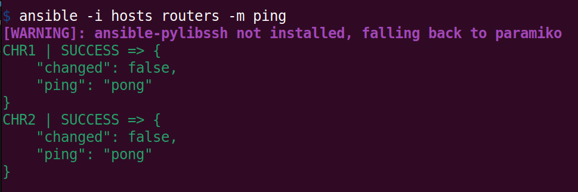

## Плэйбуки

Создаём плейбук. В нём указывается имя и используемые хосты. Можно отключить gather_fact, который собирает информацию о хостах для использования в плейбуках. Это нам не надо в данном задании, а работу чуть оптимизирует.

```
- name: lab2_setup
  hosts: routers
  gather_facts: false
```

### Смена юзера

Для работы плейбуков ansible просит библиотеку ansible-pylibssh.

```pip install ansible-pylibssh```

Создаём первую таску. В ней нужно указать, что команда даётся routeros.

```
  tasks:
    - name: user setup
      community.routeros.command:
        commands:
          - /user add name=plida password=letmein group=full
```
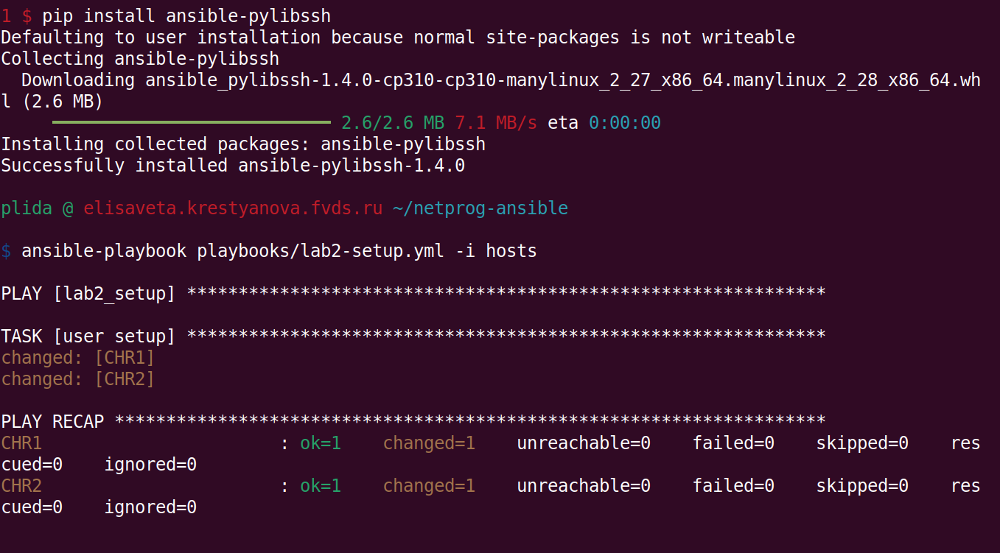


### NTP клиент

Новая таска. Берём русский NTP сервер.

```
  - name: NTP client
    community.routeros.command:
      commands:
        - /system ntp client set enabled=yes servers=0.ru.pool.ntp.org
```

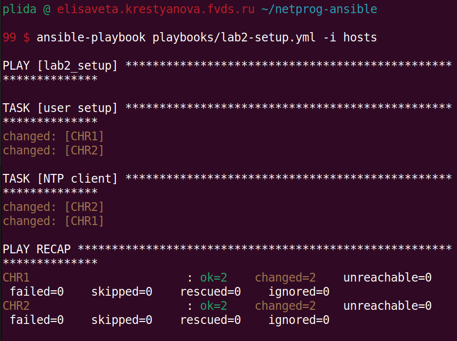


### OSPF

Задача: настроить разные loopback адреса для разных хостов.

Проблема: очень не хочется ручками в конфиге yaml их вводить.

Решение: использовать какую-то глобальную переменную, хранящую айпи адреса, и повышающая её на единицу переходя к очередному хосту.

Проблема: Ansible так не работает.

Решение: вставить адреса loopback в тот же файл hosts рядом.  

```
[routers]
CHR1 ansible_host=10.220.220.2 loopback_ip=10.255.255.221
CHR2 ansible_host=10.220.220.3 loopback_ip=10.255.255.222
```

Так они хотя бы на видном месте, и не вплетены страшным образом в логику.

Перед тем как прописывать команды, можно сделать тестовый дебаг для проверки, что действительно из hosts верный адрес забирается:

```
- name: Show loopback address
  debug: 
    var: loopback_ip
```

и вызвать этот таск: 

```ansible-playbook playbooks/lab2-setup.yml --step --start-at-task='Show loopback address' -i hosts``` 

(команда начинает с этого таска, от дальнейших можно просто отказаться).

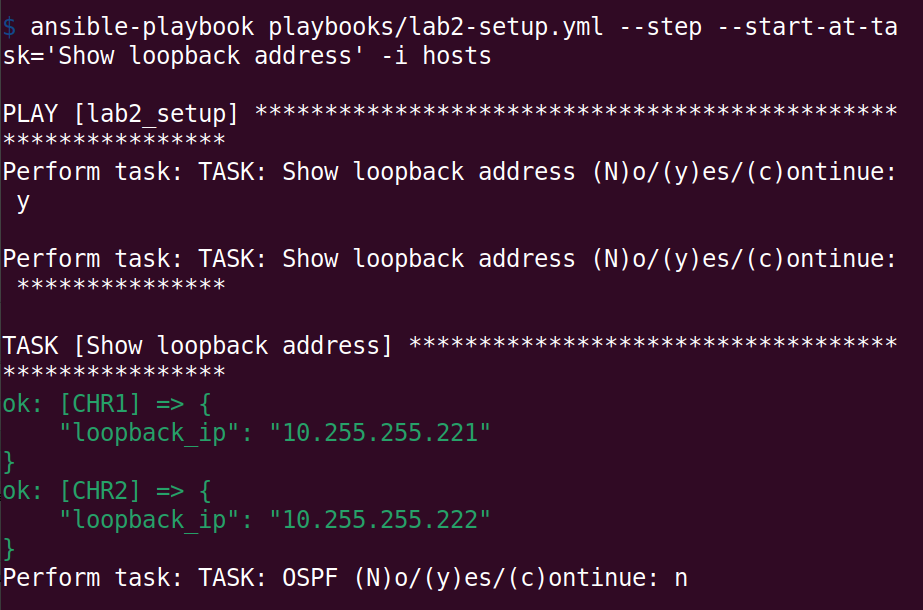

Создаём таск:

```
- name: OSPF
      community.routeros.command:
        commands:
          - /interface bridge add name=loopback
          - /ip address add address={{ loopback_ip + '/32' }} interface=loopback network={{ loopback_ip }}
          - /routing ospf instance add name=inst router-id={{ loopback_ip }}
          - /routing ospf area add name=backbonev2 area-id=0.0.0.0 instance=inst
          - /routing ospf interface-template add area=backbonev2 interfaces=ether1 type=ptp
```

### Вывод информации о роутерах

Отдельным плейбуком указываем таски по сбору информации о роутерах: routeros.facts, /export, /routing ospf neighbor и /routing ospf interface. 

Эта информация выводится в переменные (через register), которые затем записываются в файлы (через copy). 

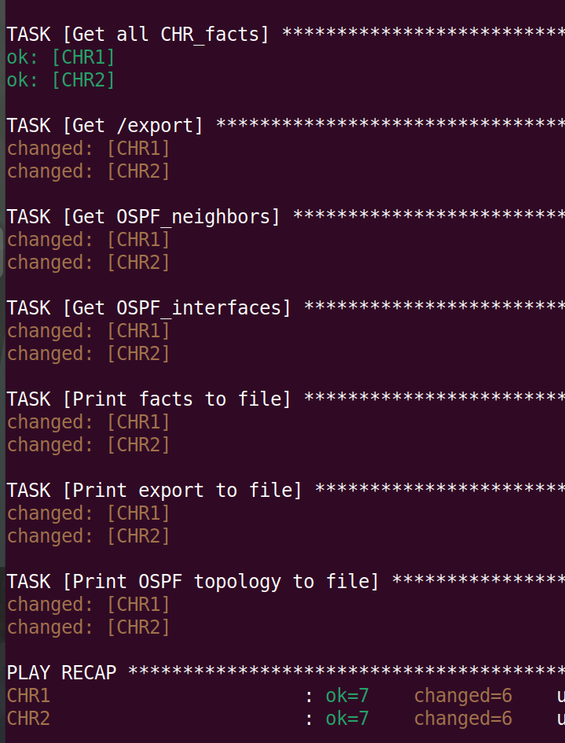

# Результаты

## Смена юзера

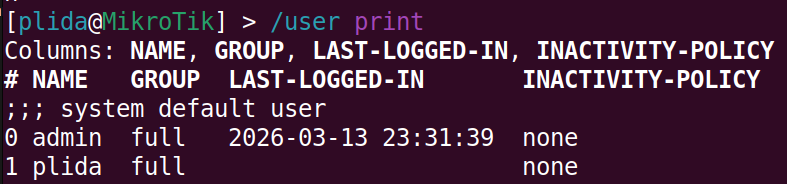

## NTP

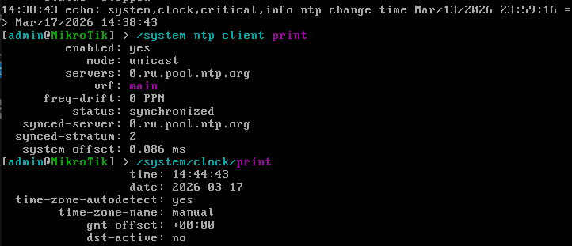

## OSPF

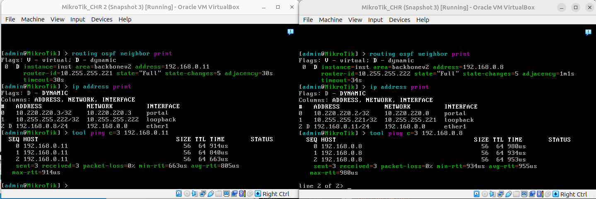

## Вывод информации

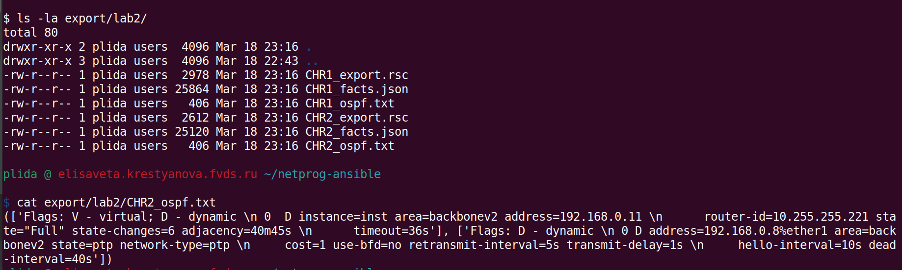


# Встреченные проблемы

## Несовместимость Ansible с CLI роутеров.

На VPS создаём hosts с айпи роутеров:

```
[routers]
CHR1 ansible_host=10.220.220.2
CHR2 ansible_host=10.220.220.3
```

Проверяем, пытаясь подключиться через Ansible ко всем роутерам...

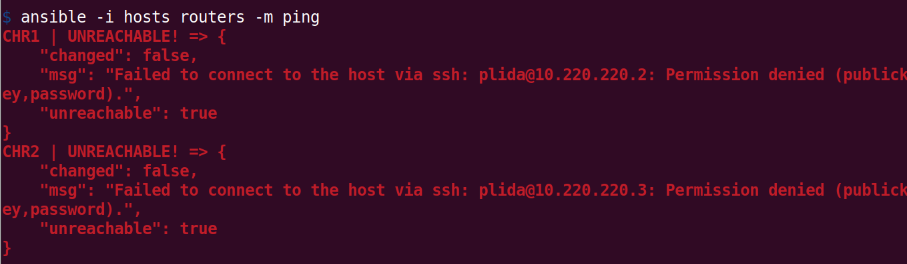 

М-м-м... а, надо переменные прописать... 

```
[routers]
CHR1 ansible_host=10.220.220.2
CHR2 ansible_host=10.220.220.3

[routers:vars]
ansible_user=admin
```

Теперь пользователь верный, запускаем.

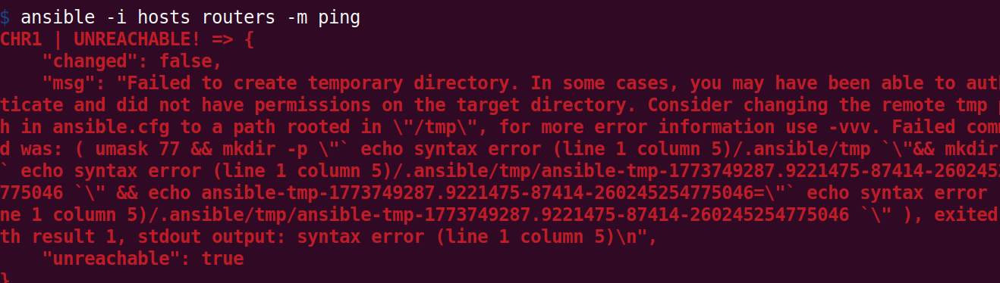 

......

```
[routers]
CHR1 ansible_host=10.220.220.2
CHR2 ansible_host=10.220.220.3

[routers:vars]
ansible_user=admin
ansible_connection=ansible.netcommon.network_cli
ansible_network_os=community.routeros.routeros
```

Через плагины нужно указать Ansible, что мы работаем с сетевым устройством с ОС routerOS, чтобы Ansible корректно работал с командным интерфейсом.

После этого пинг работает.

## ether2 на 2-м роутере

Копировала я роутер... с верой. Я скопировала машину полностью и ручками правила в ней всё, айпи, вайргард, прочие радости. 

По дороге у меня каким-то образом адрес домашний прицепился к ether2, а не к ether1, как было в предыдущем роутере. 

В секции ospf это оказалось проблемой. Всё настроила, всё вроде правильно, а соседи не появляются, как так? Смотришь: а там темплейт интерфейса не создался у этого роутера, т.к. я указала интерфейс ether1.


# Заключение

В ходе работы был склонирован роутер. На нём был настроен wireguard клиент. Затем с помощью Ansible на этих роутерах были настроены новые юзеры, NTP клиент, OSPF; а также были выведены полная информация об этих устройствах в отдельные файлы.

Цель работы была выполнена.

# Дополнительные источники

1. Ansible с RouterOS: https://docs.ansible.com/projects/ansible/latest/collections/community/routeros/docsite/ssh-guide.html#ansible-collections-community-routeros-docsite-ssh-guide

2. "Failed to create temporary directory": https://forummikrotik.ru/viewtopic.php?t=13359

3. Русские NTP сервера: https://yandex.cloud/ru/docs/tutorials/infrastructure-management/ntp?utm_referrer=https%3A%2F%2Fwww.google.com%2F

4. Настройка NTP клиента: https://настройка-микротик.рф/ntp-client-mikrotik/