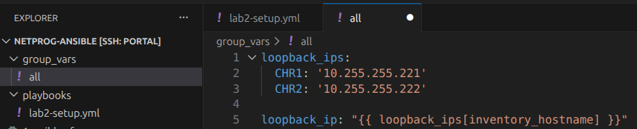

University: [ITMO University](https://itmo.ru/ru/)<br />
Faculty: [FICT](https://fict.itmo.ru)<br />
Course: [Network programming](https://github.com/itmo-ict-faculty/network-programming)<br /> 
Year: 2025/2026<br />
Group: K3323<br />
Author: Krestyanova Elisaveta Fedorovna<br />
Lab: Lab2<br />
Date of create: 13.03.2026<br />
Date of finished: ---<br />

# Задание

В данной лабораторной работе вы на практике ознакомитесь с системой управления конфигурацией Ansible, использующаяся для автоматизации настройки и развертывания программного обеспечения.

Цель работы: С помощью Ansible настроить несколько сетевых устройств и собрать информацию о них. Правильно собрать файл Inventory.

Ход работы:

- Установить второй CHR на своем ПК.
- Организовать второй OVPN Client на втором CHR.
- Используя Ansible, настроить сразу на 2-х CHR:
    логин/пароль;

    NTP Client;

    OSPF с указанием Router ID; 4. Собрать данные по OSPF топологии и полный конфиг устройства.


# Схема

# Ход работы 

## Конфигурация 2-й роутера

При клонировании контейнера на нём dhcp-клиент перестал видеть нужный интерфейс валидным. В winbox я заново в настройках dhcp-клиента выбрала интерфейс ether2, и он очнулся, получив новый айпи-адрес.


Меняем адрес на новый 10.220.220.3:


Создаём снова интерфейс, чтобы пересоздать ключи:


Публичный ключ CHR2:
nep4zIqCurxKpQLPhwhycdFvMTnf/mOqAJWw3MgJEVw=

Привязываем снова айпи адрес к интерфейсу туннеля:


И шлюз:


А в конфиг VPS добавляем соотвествующий пир:

```
[Peer]
# CHR 2
PublicKey = nep4zIqCurxKpQLPhwhycdFvMTnf/mOqAJWw3MgJEVw=
AllowedIPs = 10.220.220.3/32
PersistentKeepalive = 25
```

Проверяем:


## Ansible

### Хосты Ansible

На VPS создаём hosts с айпи роутеров:

```
[routers]
CHR1 ansible_host=10.220.220.2
CHR2 ansible_host=10.220.220.3

[routers:vars]
ansible_user=admin
ansible_connection=ansible.netcommon.network_cli
ansible_network_os=community.routeros.routeros
```

Проверяем инвентарь:


И проверяем, корректно ли подключается Ansible к роутерам: 


### Смена юзера

```pip install ansible-pylibssh```

```
- name: lab2_setup
  hosts: routers
  gather_facts: false
  tasks:
    - name: user setup
      community.routeros.command:
        commands:
          - /user add name=plida password=letmein group=full
```


### NTP клиент

```
  tasks:
    - name: NTP client
      community.routeros.command:
        commands:
          - /system ntp client set enabled=yes
```


### OSPF

Невозможно использовать глобальные переменные для 

```ansible-playbook playbooks/lab2-setup.yml --step --start-at-task='Create loopback address' -i hosts``` 




```pip install netaddr```

# Результаты

# Встреченные проблемы

## Несовместимость Ansible с CLI роутеров.

На VPS создаём hosts с айпи роутеров:

```
[routers]
CHR1 ansible_host=10.220.220.2
CHR2 ansible_host=10.220.220.3
```

Проверяем, пытаясь подключиться через Ansible ко всем роутерам...

 

М-м-м... а, надо переменные прописать... 

```
[routers]
CHR1 ansible_host=10.220.220.2
CHR2 ansible_host=10.220.220.3

[routers:vars]
ansible_user=admin
```

Теперь пользователь верный, запускаем.

 

......

```
[routers]
CHR1 ansible_host=10.220.220.2
CHR2 ansible_host=10.220.220.3

[routers:vars]
ansible_user=admin
ansible_connection=ansible.netcommon.network_cli
ansible_network_os=community.routeros.routeros
```

Через плагины нужно указать Ansible, что мы работаем с сетевым устройством с ОС routerOS, чтобы Ansible корректно работал с командным интерфейсом.

После этого пинг работает.

# Заключение

# Дополнительные источники

1. https://docs.ansible.com/projects/ansible/latest/collections/community/routeros/docsite/ssh-guide.html#ansible-collections-community-routeros-docsite-ssh-guide

2. "Failed to create temporary directory": https://forummikrotik.ru/viewtopic.php?t=13359

3. https://yandex.cloud/ru/docs/tutorials/infrastructure-management/ntp?utm_referrer=https%3A%2F%2Fwww.google.com%2F