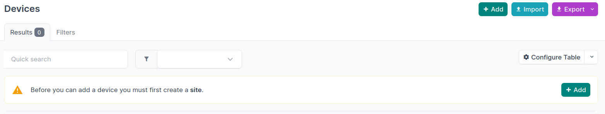
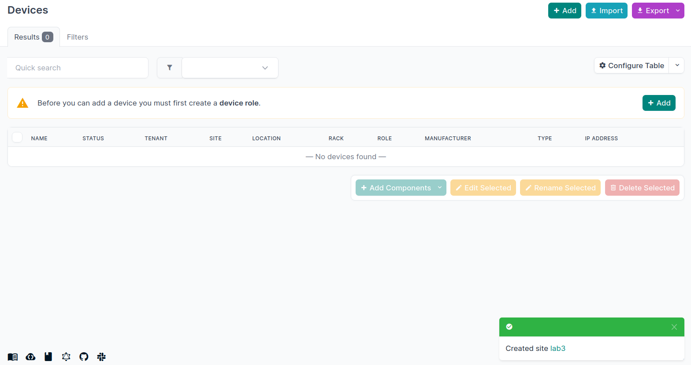
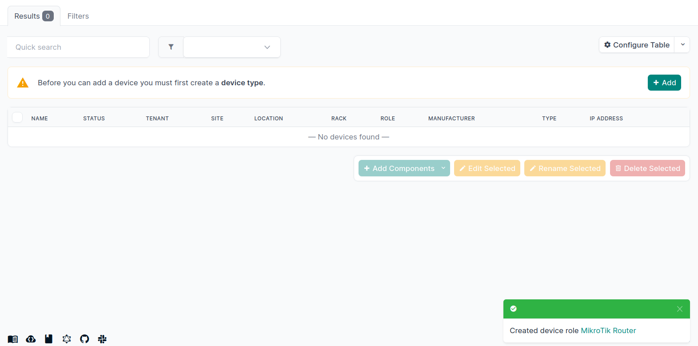
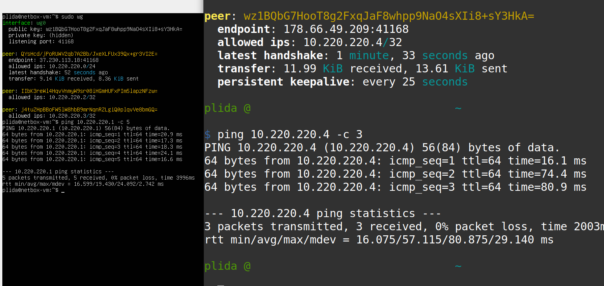
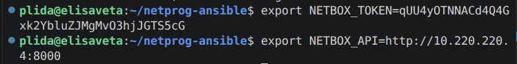
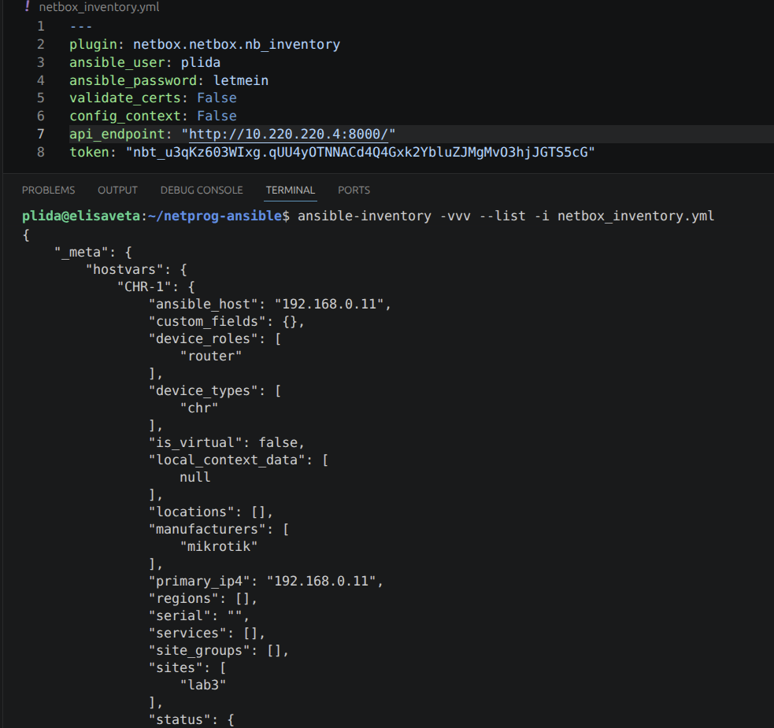
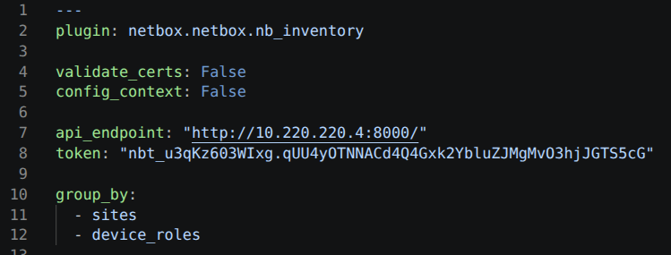
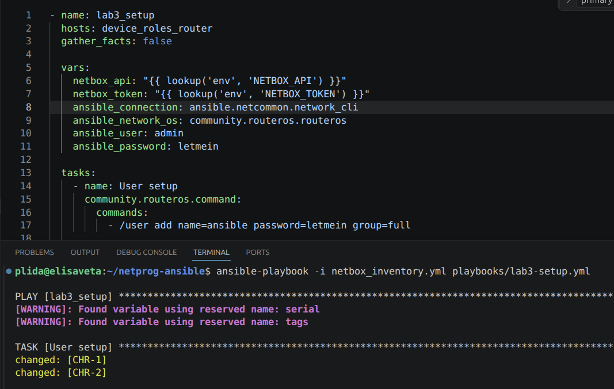
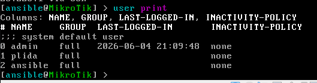

University: [ITMO University](https://itmo.ru/ru/) 
Faculty: [FICT](https://fict.itmo.ru) 
Course: [Network programming](https://github.com/itmo-ict-faculty/network-programming)  
Year: 2025/2026 
Group: K3323 
Author: Krestyanova Elisaveta Fedorovna 
Lab: Lab3 
Date of create: --- 
Date of finished: --- 

# Задание

В данной лабораторной работе вы ознакомитесь с интеграцией Ansible и Netbox и изучите методы сбора информации с помощью данной интеграции.

Цель работы: c помощью Ansible и Netbox собрать всю возможную информацию об устройствах и сохранить их в отдельном файле.

Ход работы:

1. Поднять Netbox на дополнительной VM.
2. Заполнить всю возможную информацию о ваших CHR в Netbox.
3. Используя Ansible и роли для Netbox в тестовом режиме сохранить все данные из Netbox в отдельный файл, результат приложить в отчёт.
4. Написать сценарий, при котором на основе данных из Netbox можно настроить 2 CHR, изменить имя устройства, добавить IP адрес на устройство.
5. Написать сценарий, позволяющий собрать серийный номер устройства и вносящий серийный номер в Netbox.

# Схема

# Ход работы 

В VirtualBox создаём новую виртуальную машину: Ubuntu Live server 26.04.

Netbox будем устанавливать через Docker. На виртуальной машине устанавливаем Docker 

docker compose exec netbox /opt/netbox/netbox/manage.py createsuperuser

Пришлось выключить включить контейнер, выключить включить докер и тогда я только смогла зайти 

Device role: 

Device type: 

installed wireguard on ubuntu vm 

connected tunnel

for json_query installed jmsepath 

Использование динамического инвентаря

Удалила адрес loopback, он успешно добавился

# Результаты

# Заключение

# Дополнительные источники
