University: [ITMO University](https://itmo.ru/ru/)<br />
Faculty: [FICT](https://fict.itmo.ru)<br />
Course: [Network programming](https://github.com/itmo-ict-faculty/network-programming)<br /> 
Year: 2025/2026<br />
Group: K3323<br />
Author: Krestyanova Elisaveta Fedorovna<br />
Lab: Lab3<br />
Date of create: 03.06.2026<br />
Date of finished: ---<br />

# Задание

В данной лабораторной работе вы ознакомитесь с интеграцией Ansible и Netbox и изучите методы сбора информации с помощью данной интеграции.

Цель работы: c помощью Ansible и Netbox собрать всю возможную информацию об устройствах и сохранить их в отдельном файле.

Ход работы:

1. Поднять Netbox на дополнительной VM.
2. Заполнить всю возможную информацию о ваших CHR в Netbox.
3. Используя Ansible и роли для Netbox в тестовом режиме сохранить все данные из Netbox в отдельный файл, результат приложить в отчёт.
4. Написать сценарий, при котором на основе данных из Netbox можно настроить 2 CHR, изменить имя устройства, добавить IP адрес на устройство.
5. Написать сценарий, позволяющий собрать серийный номер устройства и вносящий серийный номер в Netbox.


# Схема

# Ход работы 

## Поднятие Netbox

В VirtualBox создаём новую виртуальную машину: Ubuntu Live server 26.04.

Netbox будем устанавливать через Docker. На виртуальной машине устанавливаем Docker 

```
git clone -b release https://github.com/netbox-community/netbox-docker.git
cd netbox-docker
# Copy the example override file
cp docker-compose.override.yml.example docker-compose.override.yml
# Read and edit the file to your liking
docker compose pull
docker compose up
```

Создаётся суперюзер:

```
docker compose exec netbox /opt/netbox/netbox/manage.py createsuperuser
```

В docker-compose.override.yml указывается суперюзер:

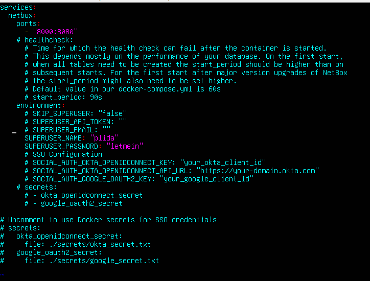

Контейнер пришлось запускать два раза, чтобы сайт поднялся.

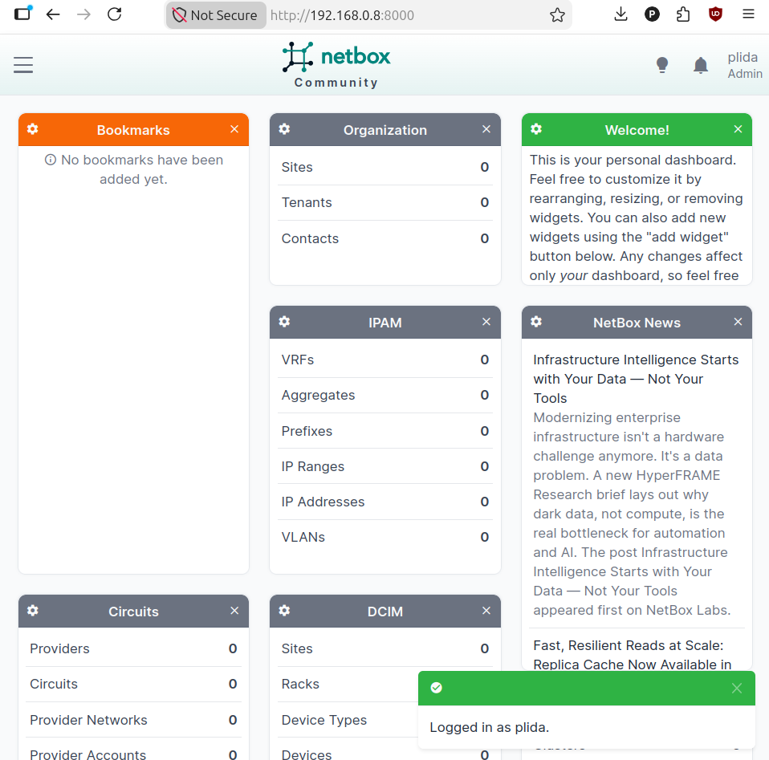

## Заполнение Netbox

В нетбоксе создаётся site "lab3", device role "Router", device type "CHR".

Device role: 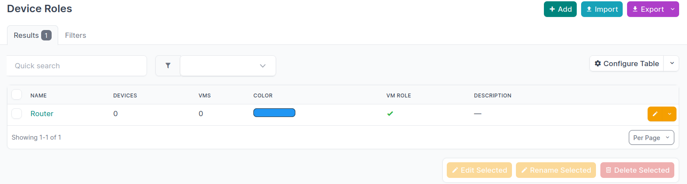

Device type: 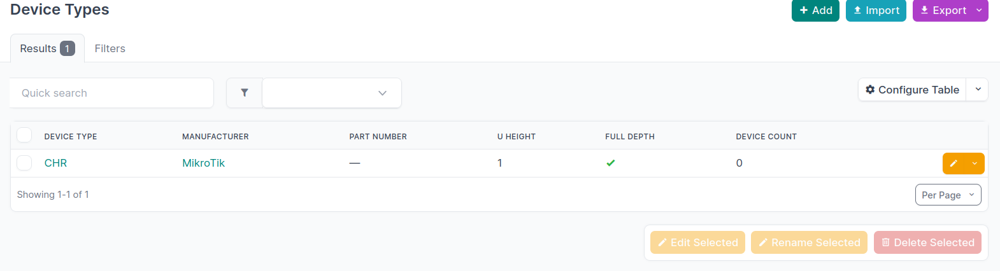

Добавляем 2 роутера, добавляем айпи-адреса и интерфейса и прикрепляем.

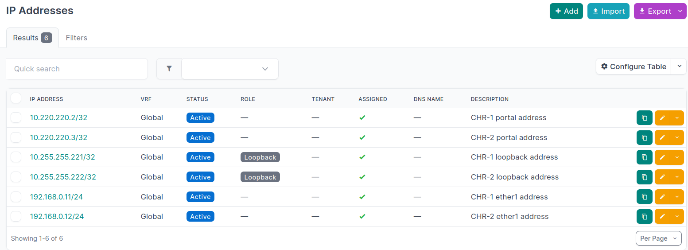

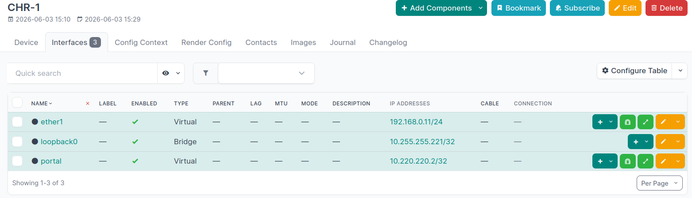

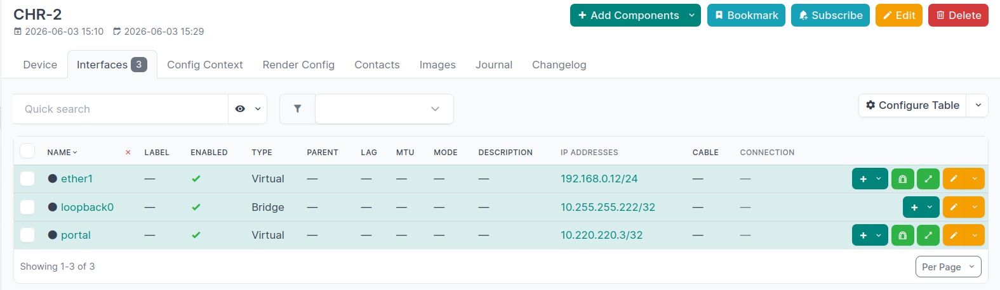

Так как Ansible у нас на арендованном сервере далеко от сервера нетбокса, их надо соединить Wireguard-ом, как это было сделано с роутерами CHR.

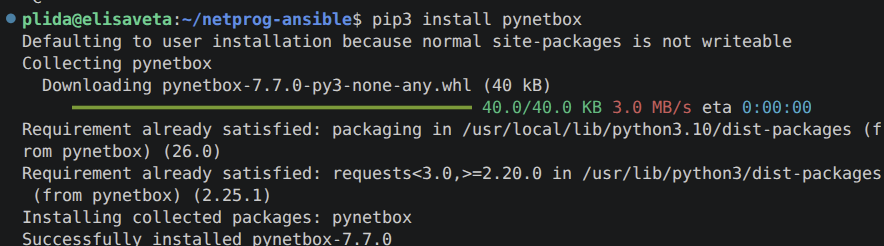

Экспортируем токен (сгенерированный на странице нетбокса) и адрес нетбокса в env. Из него плейбуки будут тянуть эти данные.


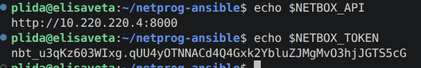


## Экспорт Netbox

Для красивого форматирования будем использовать json_query. Для этого надо установить jmsepath.

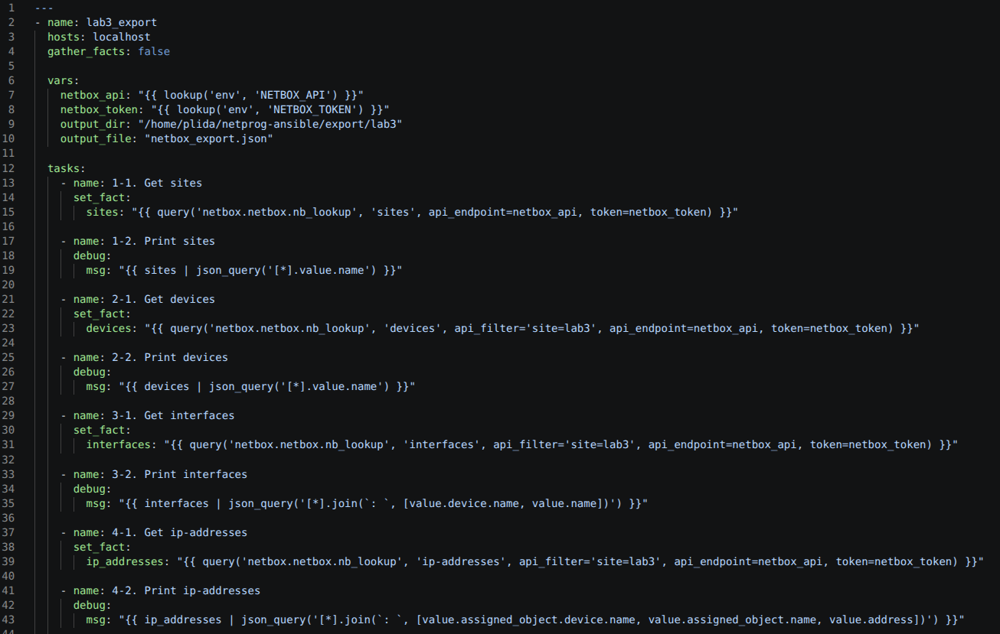

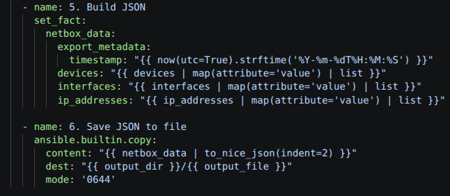

На рез

## Конфигурация CHR

Создаём динамический инвентарь netbox_inventory.yml. Из него будет браться информация о девайсах в следующих плейбуках.

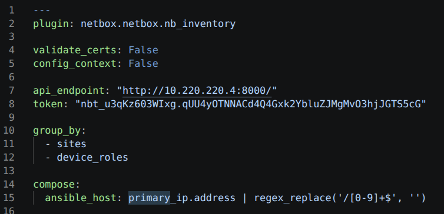

Смотрим, как хосты называются. Здесь они device_roles_router.

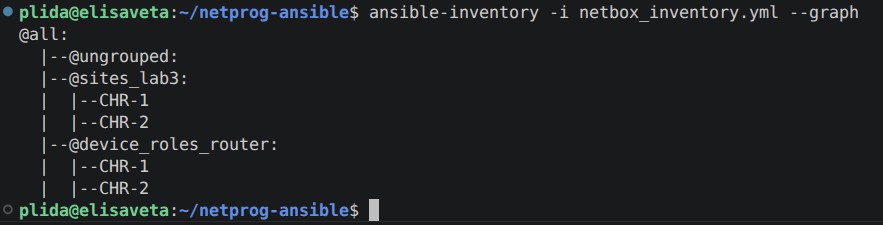

Плейбук виден на следующем рисунке. В переменные записываются знакомые строчки для работы с routerOS. При добавлении IP используется цикл, чтобы пройтись по всем адресам.

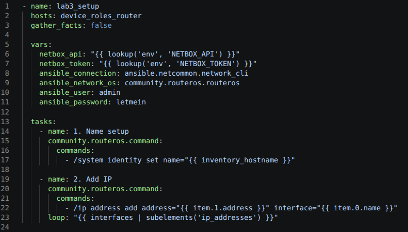

## Серийный номер

Сначала логинимся в роутеры и достаём их серийные номера, затем находим айди девайса и, подставляя его в адрес, заходим и добавляем информацию о номере.

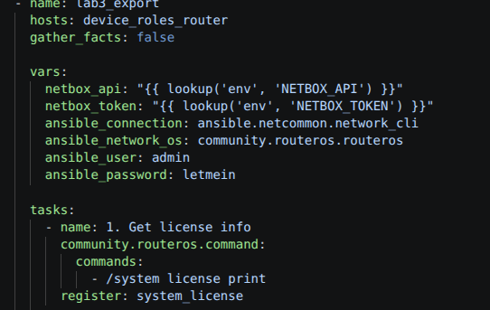

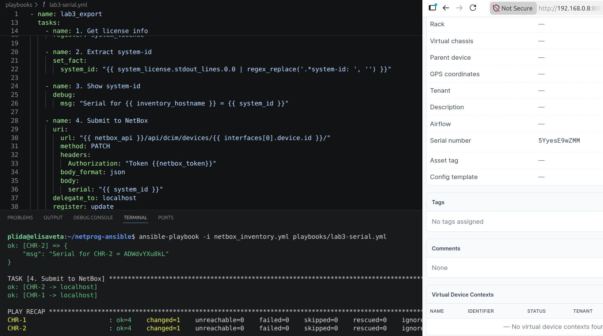

# Результаты

## Экспорт

Запускаем плейбук:

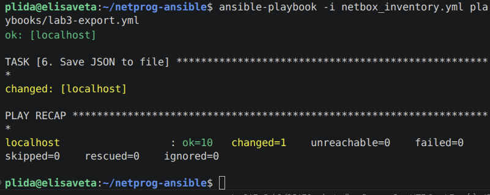

На полный экспорт можно взглянуть [здесь](export.json).

## Конфигурация CHR

Имена успешно были изменены.

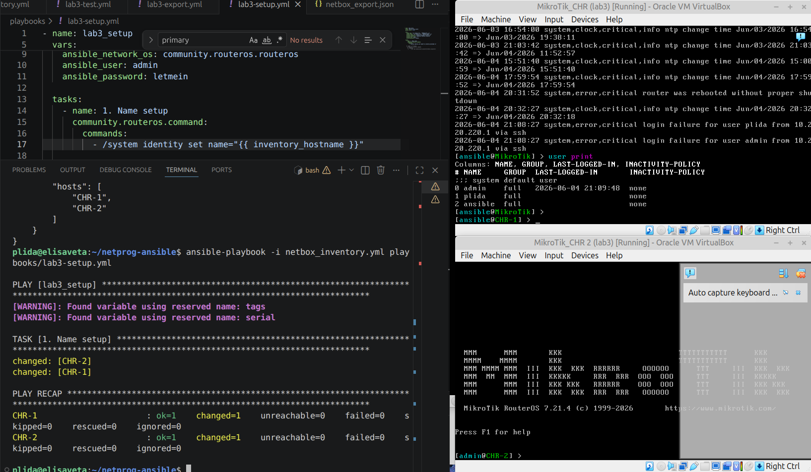


Пробуем удалить адрес loopback, запускаем плейбук - он добавится обратно.

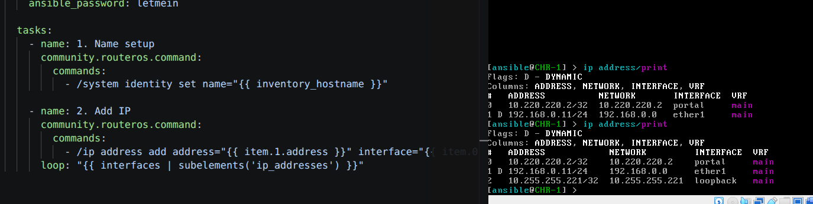

## Серийный номер

Видим, что после запуска плейбука серийный номер был успешно записан в Netbox.


# Заключение

В ходе работы был установлен Netbox на новый VM. Он был подсоединён к устройству с Ansible через Wireguard. Были написаны 3 плейбука: один экспортирует информацию из Netbox, второй конфигурирует CHR на основе динамического инвентаря Netbox, а 3-й обновляет данные о серийном номере каждого устройства.

Цель работы была выполнена.

# Дополнительные источники

Getting Started with Network Automation NetBox + Ansible - https://netboxlabs.com/blog/getting-started-with-network-automation-netbox-ansible/

How to Use Ansible to Query and Return Data from NetBox - https://netboxlabs.com/blog/how-to-use-red-hat-ansible-automation-platform-to-query-and-return-data-from-netbox/