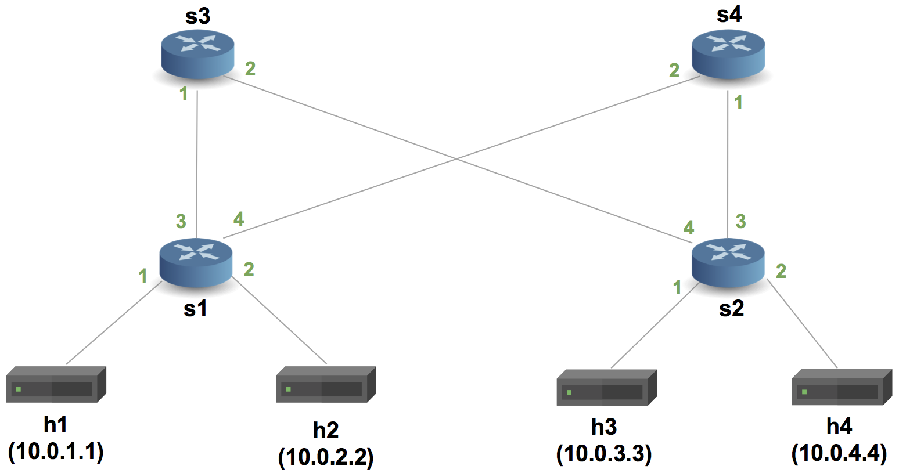
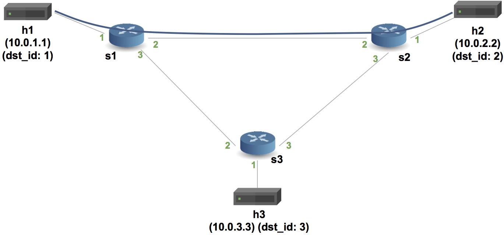
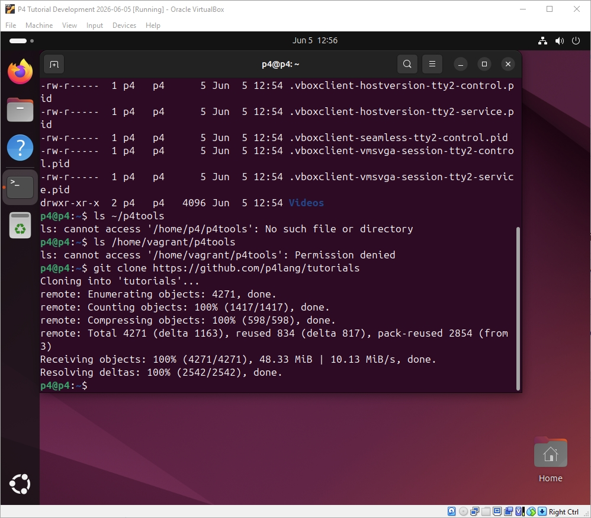
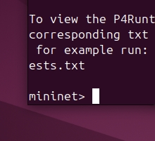
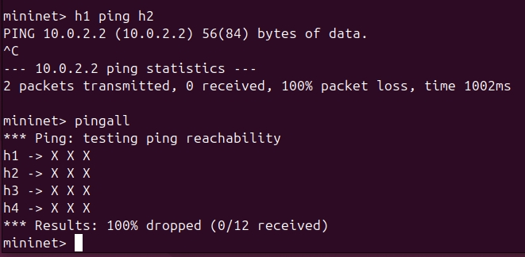
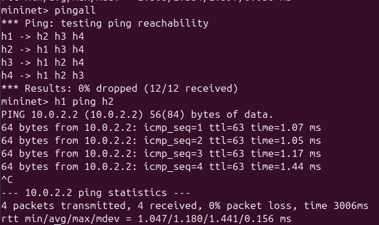
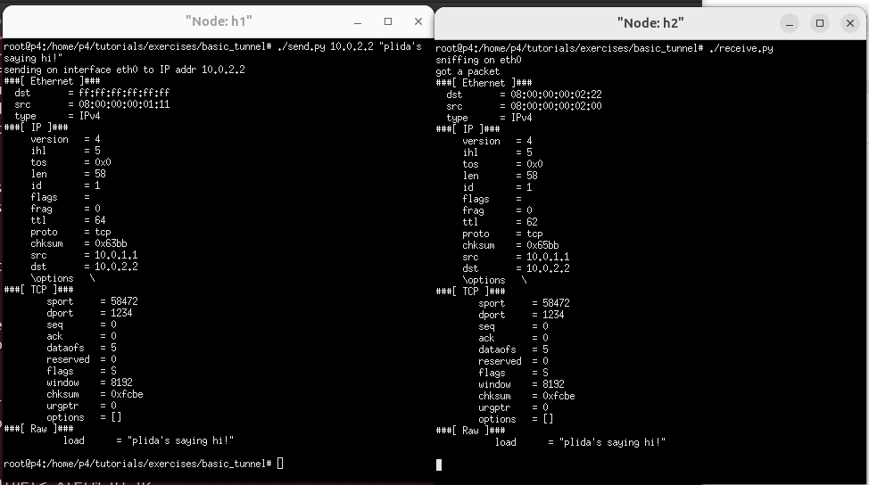
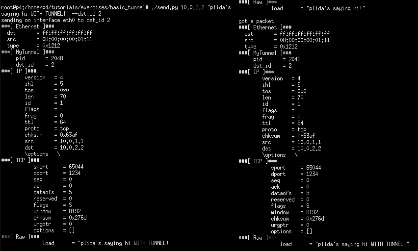
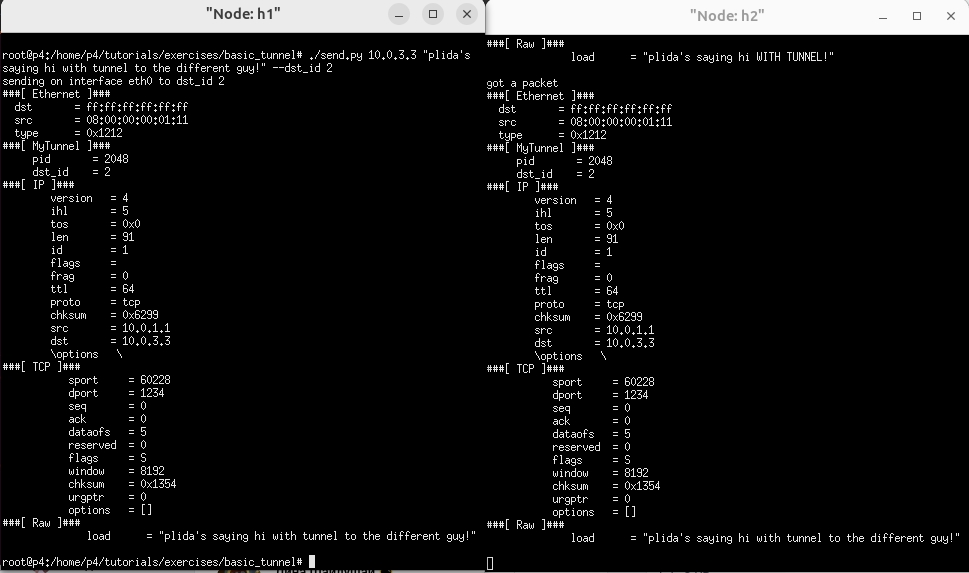

University: [ITMO University](https://itmo.ru/ru/)<br />
Faculty: [FICT](https://fict.itmo.ru)<br />
Course: [Network programming](https://github.com/itmo-ict-faculty/network-programming)<br /> 
Year: 2025/2026<br />
Group: K3323<br />
Author: Krestyanova Elisaveta Fedorovna<br />
Lab: Lab4<br />
Date of create: 05.06.2026<br />
Date of finished: 06.06.2026<br />

# Задание

В данной лабораторной работе вы познакомитесь на практике с языком программирования P4, разработанный компанией Barefoot (ныне Intel) для организации процесса обработки сетевого трафика на скорости чипа. Barefoot разработал несколько FPGA чипов для обработки трафика которые были встроенны в некоторые модели коммутаторов Arista и Brocade. 

Цель работы: изучить синтаксис языка программирования P4 и выполнить 2 задания обучающих задания от Open network foundation для ознакомления на практике с P4.

Ход работы:

Перед выполнением лабораторной работы вам необходимо выполнить следующие задачи:

    Желательно все делать на устройстве с архитектурой x86, оригинальная инструкция

- Склонировать репозиторий p4lang/tutorials
- Установить Vagrant и VirtualBox
- Перейти в папку cd vm-ubuntu-20.04
- Используя Vagrant развернуть тестовую среду vagrant up
- В результате установки у вас появится виртуальная машина с аккаунтами login/password vagrant/vagrant и p4/p4

Первой частью лабораторной работы является задание [Implementing Basic Forwarding](https://github.com/p4lang/tutorials/tree/master/exercises/basic). В нем необходимо выполнить следующие задачи: - В виртуальной машине перейдите в папку проекта и выполните задания описанные в [Implementing Basic Forwarding](https://github.com/p4lang/tutorials/tree/master/exercises/basic) - Зафиксируете результаты и укажите результаты в вашем отчете

Второй частью лабораторной работы является задание [Implementing Basic Tunneling](https://github.com/p4lang/tutorials/tree/master/exercises/basic_tunnel) В нем необходимо выполнить следующие задачи: - В виртуальной машине перейдите в папку проекта и выполните задания описанные в [Implementing Basic Tunneling](https://github.com/p4lang/tutorials/tree/master/exercises/basic_tunnel) - Зафиксируете результаты и укажите результаты в вашем отчете

# Схема

## basic



## basic_tunnel



# Ход работы 

## Установка виртуальной машины

Клонируем репозиторий p4lang/tutorials. Устанавливаем Vagrant; VirtualBox должен быть уже установлен с предыдущих работ.

В нужной папке разворачивается среда vagrant up. Он подтянет нужную убунту bento.  Важно ждать полную установку виртуальной машины перед началом работы. Также вагрант будет отказываться запускать вм, если в виртуалбоксе есть какие-либо недействительные машины, он об них спотыкается.

Когда всё запустилось, заходим за пользователя p4 (passwd: p4). Снова клонируем репозиторий.




В репозитории предоставлены инструменты, которые необходимо скомпилировать. Это очень время- и ресурсозатратный процесс, на слабых устройствах лучше это не делать. Вся установка может занять час или больше.

```
mkdir src
cd src
../tutorials/vm-ubuntu-24.04/install.sh | & tee log.txt
```

Запускаем, завариваем чай и ждём.

После установки ПЕРЕЗАГРУЖАЕМ машину!

После этих шагов теперь `make run` будет запускать упражнения. 



Если что-то пошло не так, не рекомендую пытаться копаться и самостоятельно что-то править, рискуете только время потерять. В моём случае помогла только полная переустановка, где я точно убедилась, что ничего не прервалось посреди установки.

## Basic

Полный файл: [](lab4/basic.p4).

В этом упражнении необходимо написать простую P4 программу для переадресации IPv4. 

Изначально хосты не могут достучаться друг до друга.



В парсере прописывается обработка Ethernet, смотрит в заголовке etherType, и если он 'TYPE_IPV4', то парсер извлекает данные о ipv4.

Далее в Ingress прописывается action: указывается порт, на который отправляется пакет, меняются адреса отправителя и назначения, и уменьшается TTL пакета. В apply прописывается проверка валидности заголовка ipv4 - если с ним всё хорошо, применяется таблица ipv4_lpm, в котором прописаны actions: тот что мы написали, drop и NoAction.

В депарсере с помощью packet.emit заголовки ethernet и ipv4 обратно сериализуются в байты.

## Basic-tunnel

Полный файл: [](lab4/basic_tunnel.p4).

В этом упражнении необходимо обрабатывать заголовок myTunnel. 

В конфиге уже прописан новый заголовок с значениями proto_id и dst_id. В парсер добавляется новый state по обработке заголовка туннеля. В нём проверяется proto-id, если он соответствует ipv4, то он так же парсится.

В Ingress добавляется новый action для переадресации туннеля: указывается порт. Добавляется новая таблица для туннеля table myTunnel_exact, в котором вместо lpm используется exact. В apply добавляется проверка: если заголовок туннеля невалидный а ipv4 валидный, то применяется таблица ipv4; иначе, если заголовок туннеля валидный, но таблица туннелирования.

В депарсере добавляется packet.emit(hdr.myTunnel).

# Результаты

## Basic

С полным конфигом все хосты успешно видят друг-друга:




## Basic-tunnel

Отправка сообщения по айпи-адресам.



Отправка сообщения по данным туннеля.



Демонстрация, как свитч игнорирует айпи-адрес: если отправить сообщение по айпи-адресу 3-его хоста, но айди туннеля 2-го хоста, сообщение придёт на 2-й хост.



# Заключение

В ходе работы была установлена виртуальная машина с помощью Vagrant и VirtualBox. В ней были установленые инструменты P4, а затем выполнены два простых задания: basic forwarding и basic tunneling из туториалов языка.

Цель работы была выполнена.

# Дополнительные источники

Установка инструментов P4 - https://github.com/p4lang/tutorials/blob/master/vm-ubuntu-24.04/README.md

Implementing Basic Forwarding - https://github.com/p4lang/tutorials/tree/master/exercises/basic

Implementing Basic Tunneling - https://github.com/p4lang/tutorials/tree/master/exercises/basic_tunnel
